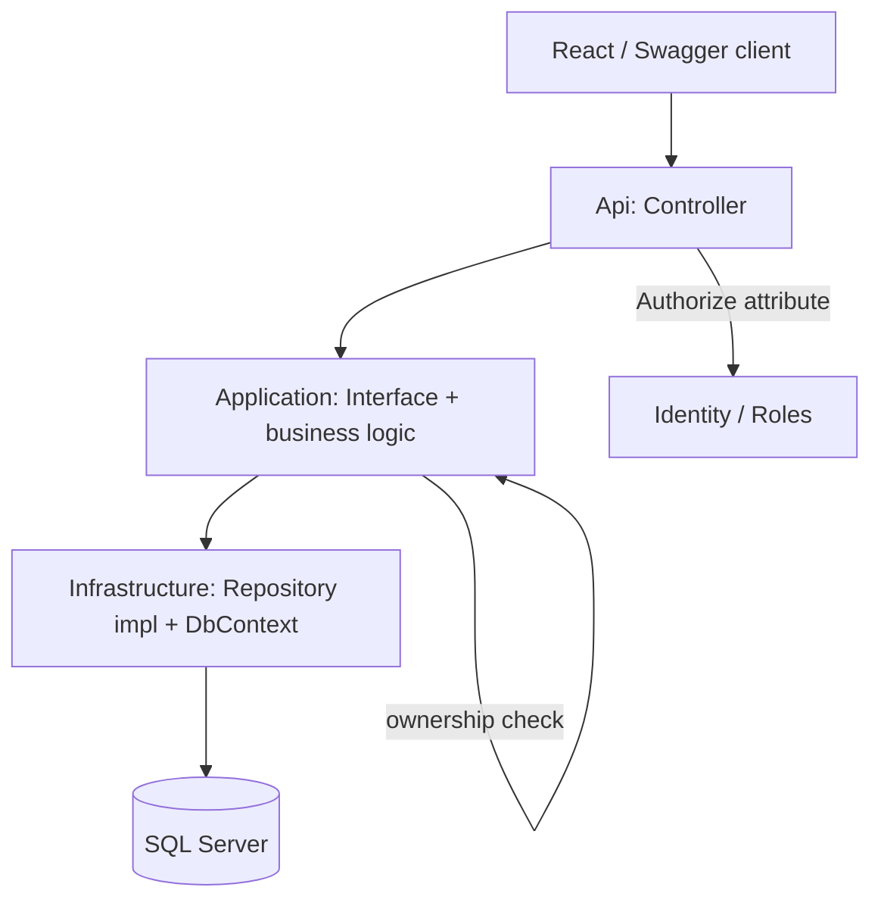

# 01 — Architecture Overview

## Stack
- ASP.NET Core Web API (no Razor views — API returns data, Swagger documents/tests it)
- ASP.NET Core Identity for authentication + roles
- Entity Framework Core + SQL Server for data access
- Swagger / OpenAPI (via Swashbuckle.AspNetCore) for API documentation and manual testing
- Frontend (React, and later a mobile app) is a separate consumer of the API — built/assisted by AI where needed, not the focus of my own learning here

## Architecture style: Clean Architecture, four projects in one solution
```
JobBoard (solution)
├── JobBoard.Domain          <- entities, enums. Depends on nothing.
├── JobBoard.Application     <- interfaces, business/use-case logic. Depends on Domain.
├── JobBoard.Infrastructure  <- EF Core, Identity, external services. Depends on Application + Domain.
└── JobBoard.Api             <- controllers, Swagger, HTTP concerns. Depends on Application + Infrastructure.
```

Dependency rule to keep saying out loud until it's automatic: **dependencies point inward.** Domain knows about nothing else. Everything else knows about Domain. Api is the outermost layer and can see everything; Domain can see nothing.

## Why this over a single project (reasoning, not just "it's more professional")
- Forces explicit boundaries: a repository interface lives in Application, its EF Core implementation lives in Infrastructure — this makes swapping the database, or unit-testing business logic without a real database, structurally possible rather than theoretical.
- Controllers in Api can only reach business logic through Application's interfaces — this makes "don't write logic in controllers" a compiler-enforced rule, not just discipline.
- Previously deferred this (see decision log) to avoid complexity while learning Identity/EF Core basics. Reversed that decision once Identity fundamentals were solid, on the reasoning that repeated deferral tends to become permanent avoidance.

## Where things live
- **Domain**: `Job`, `JobApplication`, enums (`JobType`, etc.), and any domain-only logic that doesn't need external dependencies.
- **Application**: interfaces like `IJobRepository`, `IJobService`; DTOs for request/response shaping; validation/business rules that orchestrate domain objects.
- **Infrastructure**: `ApplicationDbContext`, EF Core migrations, concrete repository implementations, Identity configuration.
- **Api**: Controllers (`: ControllerBase`, `[ApiController]`), Swagger setup, `Program.cs`, DI wiring that connects interfaces (Application) to implementations (Infrastructure).

## Request lifecycle example (walk through this from memory)
"Employer creates a job posting":
1. React (or Swagger, for manual testing) sends `POST /api/jobs` with a JSON body.
2. `JobsController` (Api) receives it, model-binds into a request DTO (not the raw `Job` entity — same over-posting reasoning as before, just DTOs instead of ViewModels now).
3. Controller checks `ModelState.IsValid`, then calls `IJobService.CreateJob(...)` — an interface defined in Application.
4. The concrete implementation (Infrastructure) does the ownership assignment (current logged-in user's Id, never trusted from the request body) and persists via `ApplicationDbContext`.
5. Controller returns `Ok(...)` or `CreatedAtAction(...)` with the created resource — no redirects, this is an API, not a browser flow.

## Authorization architecture (still the part I most need to get right)
Same two enforcement points as before, just expressed via API responses instead of redirects:
- **Attribute-level:** `[Authorize(Roles = "Employer")]` on endpoints only Employers should reach at all. Failure → 401/403, not a redirect to a login page.
- **Ownership-level:** compare the resource's owner id to the logged-in user's id before allowing edit/delete, regardless of role. This lives in Application/Infrastructure logic, not scattered in the controller.

## Diagram: component relationship (Mermaid)

