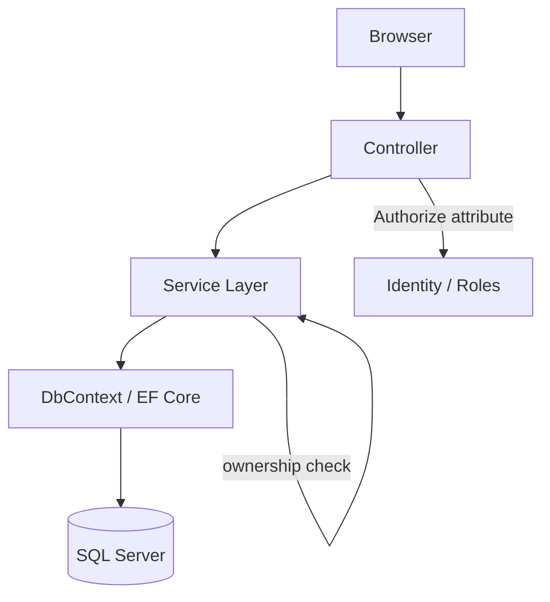

# 01 — Architecture Overview

## Stack
- ASP.NET Core MVC (Razor views, not a separate SPA frontend — at least not in Phase 1)
- ASP.NET Core Identity for authentication + roles
- Entity Framework Core + SQL Server for data access
- Bootstrap for styling (AI-generated markup is acceptable here — this is explicitly the "frontend, don't sweat it" zone from the requirements doc)

## High-level architecture style
Standard layered MVC, not microservices, not CQRS, not a separate API project — deliberately simple, because the goal is depth on fundamentals, not architectural sophistication for its own sake. Over-engineering this would just be procrastination wearing a nicer outfit.

```
Browser
   |
   v
Controllers  (handle HTTP requests, call services/repositories, return Views)
   |
   v
Services / Repository layer  (business logic, ownership checks, queries)
   |
   v
DbContext (EF Core)
   |
   v
SQL Server database
```

## Why a service/repository layer at all (rather than DbContext directly in controllers)
Kudvenkat's playlist covers the Repository pattern (video 49) — this is a deliberate spot to apply it rather than just watch it. Reasoning I should be able to state out loud:
- Ownership checks (e.g. "is this Job owned by the logged-in Employer?") are business logic, not HTTP logic. They don't belong crammed into a controller action.
- Keeping controllers thin makes them easier to reason about and test later.
- I do NOT need this to be enterprise-grade. A simple `IJobService` / `JobService` with a few methods is enough. Resist the urge to over-abstract.

## Request lifecycle example (walk through this from memory, don't just read it)
"Employer creates a job posting":
1. Employer, logged in, navigates to `/Jobs/Create` (GET) → Controller returns the form view.
2. Employer submits form → POST to `/Jobs/Create` → Model binding populates a `Job` (or `JobCreateViewModel`) from form fields.
3. Controller checks `ModelState.IsValid`.
4. Controller calls a service method, passing the current logged-in user's Id as the owner — never trusting a hidden form field for this.
5. Service persists via DbContext, EF Core generates the SQL insert.
6. Controller redirects (Post-Redirect-Get pattern — already covered in the playlist) to the Employer's dashboard.

## Authorization architecture (the part I most need to get right)
Two enforcement points, both required — neither alone is enough:
- **Attribute-level:** `[Authorize(Roles = "Employer")]` on controllers/actions that only Employers should reach at all.
- **Ownership-level (resource-based):** even with the role attribute in place, an Employer could still try to edit *another* Employer's job by guessing the URL/id. This requires an explicit check inside the action or service: compare the record's owner id to the logged-in user's id before allowing edit/delete. This is the check I must consciously write and consciously test by trying to break it — see `03-requirements.md` section 2.2.

## Folder-level architecture (see 04-project-structure-guide.md for what goes inside each)
```
/Controllers
/Models            <- domain entities (Job, Application, etc.)
/ViewModels         <- shapes tailored for specific views/forms, not raw entities
/Views
/Services           <- business logic + ownership checks
/Data               <- DbContext, migrations
wwwroot/            <- static assets, AI-generated frontend lives here without guilt
```

## Diagram: component relationship (Mermaid — renders on GitHub)

