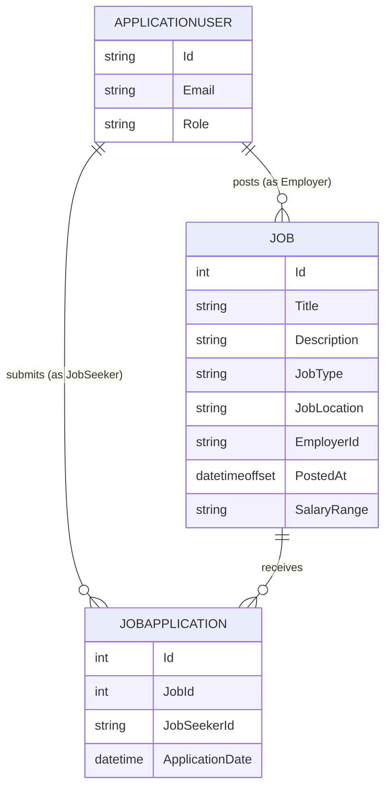

# 02 — Domain Model

This is architecture-level thinking (what exists and how it relates), not code. Writing the actual C# classes, migrations, and validation logic is still mine to do. Entities below live in `JobBoard.Domain`.

## Core entities

**ApplicationUser** (extends `IdentityUser`, lives in Infrastructure or a shared Identity area — decide and log which)
- Identity already gives you Id, Email, PasswordHash, etc.
- Add a `Role` distinction via ASP.NET Core Identity's built-in Roles system (`Employer` role, `JobSeeker` role, assigned at registration) rather than a custom column.

**Job** (`JobBoard.Domain.Entities.Job`)
- Belongs to exactly one Employer (an `ApplicationUser` in the Employer role).
- Fields as currently implemented: Id, Title, Description, JobType (enum), JobLocation, EmployerId, PostedAt (`DateTimeOffset`), SalaryRange.
- Owner reference: `EmployerId`, a foreign key to the Employer's ApplicationUser Id. This is the field the ownership check compares against.
- **Open item to resolve:** `JobType` enum currently includes `FullTime/PartTime/Contract/HourBased`, and a separate `Location` enum includes `OnSite/Remote`. Check for overlap — is "remote" a job type, a location attribute, or does it legitimately need to exist as both a work arrangement (remote vs onsite) and a broader location field (city/region) once real geography matters? Resolve and log the reasoning before this causes confusion in filtering logic later.

**JobApplication** (careful with naming — avoid confusion with the .NET "Application" project-level term; `JobApplication` as a class name is correct)
- Belongs to exactly one Job.
- Belongs to exactly one Job Seeker (an `ApplicationUser` in the JobSeeker role).
- A given (Job, JobSeeker) pair should be unique — this is where the "can't apply twice" rule lives. Decide whether this is enforced via a unique database constraint, an application-level check before insert, or both.
- Fields (Phase 1): ApplicationDate (server-side).
- Phase 2 adds a Status field (Pending/Reviewed/Rejected/Accepted).

## Relationships (ER, conceptual)

## Open design questions (update Decision: lines as resolved)

1. **Employer/JobSeeker as roles on one ApplicationUser table, vs. separate profile tables per role?**
   - Decision:

2. **Where exactly does the "already applied" duplicate check live (Application layer service vs. database constraint vs. both)?**
   - Decision:

3. **JobType vs Location enum overlap (see note under Job above) — how do these two concepts actually relate?**
   - Decision:

4. **Where does `ApplicationUser` physically live in the Clean Architecture split — Domain, or Infrastructure (since Identity is a framework/infrastructure concern)?**
   - Decision:

## What NOT to model yet (Phase 2+, don't build the columns/tables now)
- Resume file storage
- Application status
- Notifications
- Anything from `08-future-vision.md` (payments, AI matching, freelance mode, CV parsing) — that file is explicitly out of scope until Phase 1/2 are done and I've consciously replanned
