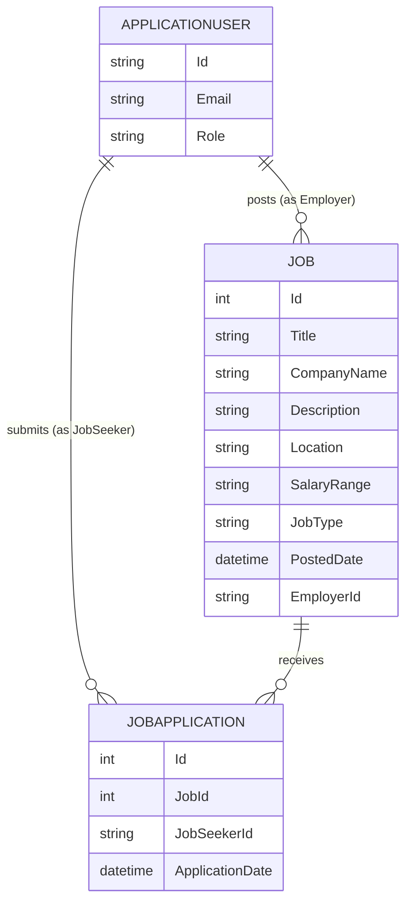

# 02 — Domain Model

This is architecture-level thinking (what exists and how it relates), not code. Writing the actual C# classes, migrations, and validation logic is still mine to do.

## Core entities

**ApplicationUser** (extends `IdentityUser`)
- Identity already gives you Id, Email, PasswordHash, etc.
- Add a `Role` distinction — either via ASP.NET Core Identity's built-in Roles system (recommended: `Employer` role, `JobSeeker` role, assigned at registration) rather than a custom column. This is exactly what the playlist's Identity/roles sections (78-83) cover — use those concepts here instead of in the old Employee Management project.

**Job**
- Belongs to exactly one Employer (an `ApplicationUser` in the Employer role).
- Fields: Title, CompanyName, Description, Location, SalaryRange (nullable), JobType (enum: FullTime/PartTime/Remote), PostedDate (set server-side).
- Owner reference: a foreign key to the Employer's ApplicationUser Id. This foreign key is the field the ownership check (see 01-architecture-overview.md) compares against.

**Application** (the "a Job Seeker applied to a Job" record — careful, this name collides conceptually with "Application" the .NET project itself; consider naming the class `JobApplication` in code to avoid confusion)
- Belongs to exactly one Job.
- Belongs to exactly one Job Seeker (an `ApplicationUser` in the JobSeeker role).
- A given (Job, JobSeeker) pair should be unique — this is where the "can't apply twice" rule lives. Think about whether this is enforced with a unique database constraint, an application-level check before insert, or both, and be able to explain the tradeoff.
- Fields (Phase 1): ApplicationDate (server-side), and that's close to it — no resume, no cover letter yet.
- Phase 2 adds a Status field (Pending/Reviewed/Rejected/Accepted).

## Relationships (ER, conceptual)

## Open design questions to resolve myself before writing model classes
(Write my own answer in this file, in a "Decision:" line under each, once decided — don't leave these unresolved once I start coding.)

1. **Employer/JobSeeker as roles on one ApplicationUser table, vs. separate profile tables per role?**
   - Roles-only is simpler and matches what the playlist teaches. Separate profile tables would matter more if Employers needed extra fields (company logo, company description) that Job Seekers don't. Given Phase 1 has no such fields, roles-only is likely sufficient — but decide and write down *why*, don't just default silently.
   - Decision:

2. **Where exactly does the "already applied" duplicate check live?**
   - Decision:

3. **Does `JobType` deserve its own lookup table, or is a C# enum enough for Phase 1?**
   - An enum is almost certainly enough. A lookup table is the kind of thing that sounds "more professional" but is actually unnecessary complexity here. Naming this bias explicitly so I don't fall for it later.
   - Decision:

## What NOT to model yet (Phase 2+, don't build the columns/tables now)
- Resume file storage
- Application status
- Notifications
